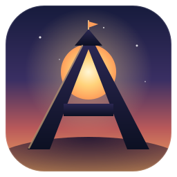

<p align="center">
  
</p>

<h1 align="center">Arcadia</h1>

<p align="center">
  <em>A living wallpaper that grows a world out of your day.</em>
</p>

<p align="center">
  
  
  
</p>

---

Arcadia is a painterly, animated **living-wallpaper web app**. It renders a layered scene that drifts
with your mouse, shifts color with the real time of day, and breathes on its own — designed to sit
calmly behind your windows all day (via [Plash](https://github.com/sindresorhus/Plash) on macOS).

The guiding feeling, in every state: **calm and rewarding, never demanding.** This repo is the
foundation — a proven parallax + day/night + wallpaper pipeline that later phases grow a personal
dashboard and a living kingdom on top of.

## ✨ Features

- **Parallax depth** — ~5 layers drift at different rates from a single `requestAnimationFrame` loop, eased, with a gentle idle sway when the mouse is still.
- **Day/night tint** — a full-screen overlay interpolates dawn → morning → golden hour → dusk → night from the real clock.
- **Drifting clouds** — a seamless, slow cloud loop across the sky.
- **Dev time scrubber** — a dev-only slider to preview the tint across all 24 hours instantly.
- **Drop-in art** — swap placeholder shapes for real painterly PNGs with zero code changes.
- **Respectful & light** — honors `prefers-reduced-motion`, pauses when the tab is hidden, animates only `transform`/`opacity`, and ships with **no runtime dependencies**.

## 🛠 Tech stack

**Vite + React + TypeScript.** Parallax and tint are pure `requestAnimationFrame` + CSS transforms —
no animation, state, or data libraries.

## 🚀 Getting started

```bash
npm install
npm run dev      # dev server at http://localhost:5173
npm run build    # production build to dist/
```

Append `?dev` to the URL (or run in dev mode) to reveal the time-of-day scrubber.

## 🖥 Use it as your wallpaper

1. Install [Plash](https://github.com/sindresorhus/Plash) (macOS).
2. Point Plash at `http://localhost:5173` (live iteration) or your built `dist/`.
3. Keep Plash **Browser Mode off** to view the default idle state.

## 🎨 Adding real art

Drop a PNG into `public/layers/` and set `src` on the matching entry in `src/scene/layers.ts`:

```ts
{ id: "castle", depth: 0.08, src: "/layers/castle.png" },
```

No other code changes needed — the scene renders the image instead of its placeholder.

## 📁 Project structure

```
src/
  App.tsx                  # mounts Scene + TintOverlay (+ dev scrubber)
  scene/
    Scene.tsx              # renders the parallax layers
    layers.ts              # layer config: { id, depth, src? }
  hooks/
    useParallax.ts         # mouse + idle drift -> per-layer transforms
    useTimeOfDay.ts        # clock (or dev override) -> tint rgba
  components/
    TintOverlay.tsx        # full-screen blended color overlay
    DevTimeScrubber.tsx    # dev-only hour override slider
  lib/lerp.ts              # numeric helpers
public/
  layers/                  # real PNGs dropped here (sky.png, castle.png, ...)
```

## 🗺 Roadmap

| Phase | What | Status |
|------|------|--------|
| **0** | Prove the loop — parallax + day/night + clouds in Plash | ✅ Complete |
| **1** | Home/Office dashboard — widgets, idle/active state machine | Next |
| **2** | Subtly alive — real data gently changes the scene | Planned |
| **3** | Adventure mode — a living-kingdom diorama on the same engine | Planned |
| **4** | Someday — seasons, events, deeper customization | Planned |

Full detail in [`Planning/personal-fantasy-os-roadmap.md`](Planning/personal-fantasy-os-roadmap.md)
and progress in [`Planning/progress.md`](Planning/progress.md).

## 📄 License

Personal project. All rights reserved.
